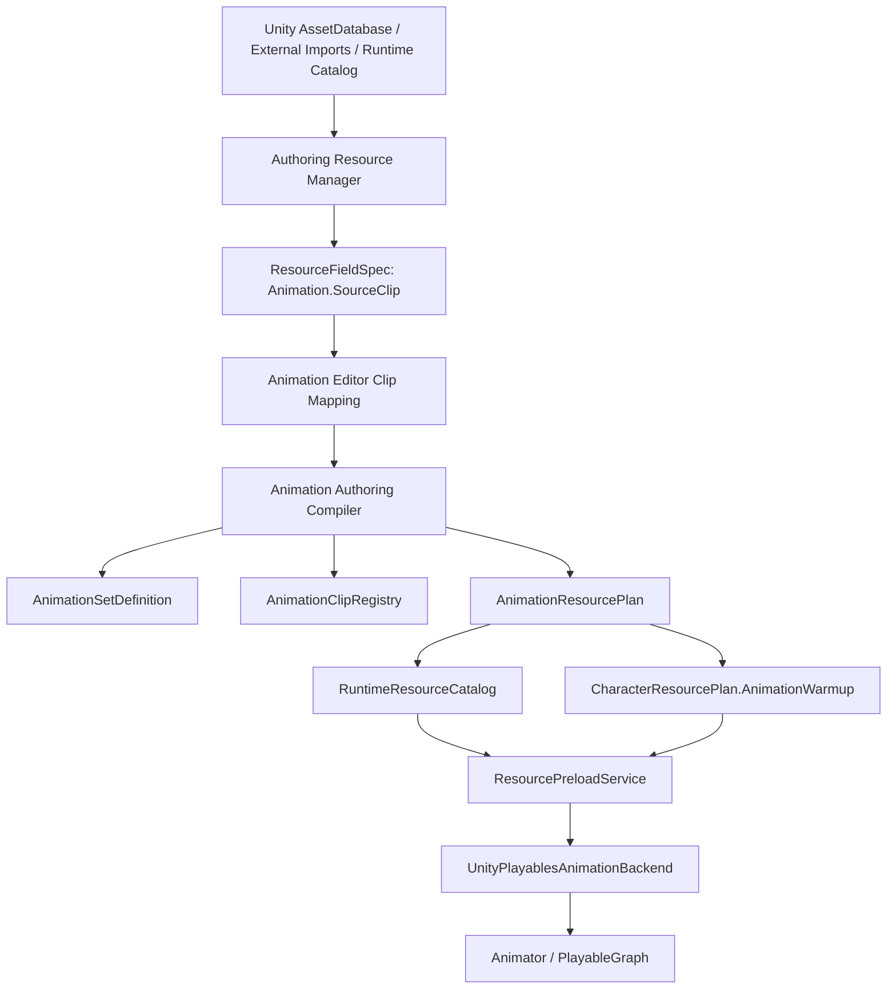

# Animation Editor 01：Native AnimationClip Source and Unity Runtime Consumption

> 状态：Development Spec
>
> Milestone 建议：`[Authoring] Animation Editor Native Clip + Runtime Consumption`
>
> 前置：`Docs/Tasks/ANIMATION_EDITOR_00_DESIGN.md`、`Docs/Tasks/CHARACTER_RESOURCE_LIBRARY_00_DESIGN.md`、`Docs/Tasks/CHARACTER_RESOURCE_LIBRARY_EDITOR_01_MVP.md`、`Docs/Tasks/MX_ANIMATION_01_DESIGN_CONTRACT.md`、`Docs/Tasks/MX_ANIMATION_10_WARMUP_RESOURCE_VERSION_VALIDATION.md`
>
> 当前代码依据：`Tools/MxFramework.AnimationEditor`、`Tools/MxFramework.Authoring/src/MxFramework.Authoring.Core/AnimationAuthoring`、`Assets/Scripts/MxFramework/Animation.Unity`

## Summary

当前 Animation Editor 已有独立启动、包加载/保存/校验、Group/Clip/Blend/Timeline 编辑、资源选择器和基础 3D 预览面板。但它还没有形成一条可靠的“Unity 原生动画资源 -> Animation authoring -> 编译产物 -> Unity runtime 播放”闭环。

本阶段目标是把动画资源从临时 GLB 预览和手填 `sourceClipName`，推进到以 Unity 原生 `AnimationClip` 为主的可用链路：

```text
Authoring Resource Manager
  发现 Unity AnimationClip / model sub-clips / runtime catalog clips
  不把外部 .fbx 文件本身伪装成 animationClip

Animation Editor
  只编辑 AnimationSet / AnimationGroup / Clip mapping / Blend / Timeline
  通过 ResourceFieldSpec 选择源 clip 和 sub-clip

Authoring Compiler
  把 ResourceSelectionRef 解析为 Runtime ResourceKey / AnimationClipRegistry / Warmup

Unity Import / Runtime Catalog
  生成或同步 AnimationClip catalog entries

Runtime
  ResourcePreloadService 预热
  UnityPlayablesAnimationBackend 通过 IResourceManager 加载 AnimationClip 并播放
```

这不是重新设计资源系统。运行时仍复用 `MxFramework.Resources`、`ResourceCatalogEntry`、`ResourcePreloadService`、`ResourceRetainPolicy` 和已有 `MxFramework.Animation.Unity` 后端。

## Problem Statement

当前缺口集中在四处：

1. 资源发现还不够精确。
   `UnityProjectAssetAuthoringResourceProvider` 能发现 `.anim` 和部分 `.glb/.gltf` 动画容器，但外部 `.fbx`、Unity model sub-assets、真实 `AnimationClip` 运行时 key 的关系尚未完整建模。外部文件夹导入也不能把 `.fbx` 文件直接当作 `animationClip` 或 `animationClipGroup` 使用。

2. Animation Editor 仍保留过多手填字段。
   `sourceClipName` 应该由资源选择和 sub-clip 元数据推导。用户不应该靠输入字符串猜 Unity clip 名称。

3. Web 3D 预览不是权威预览。
   当前 Three.js 预览可以用于 smoke，但 GLTF track retarget 到 skeleton 的结果只能说明“前端播放器活着”，不能证明 Unity `AnimationClip` 会在游戏中正确驱动角色。

4. Unity 运行时消费链路还没有完成端到端验收。
   编译器已经能产生 animation set、clip registry 和 resource plan 形状，但还需要验证 runtime catalog、warmup、正常资源加载流程和 `UnityPlayablesAnimationBackend` 在实际角色实例上协同工作。

## Product Boundary

### Resource Manager 负责

- 发现 Unity 项目内可用动画资源：
  - `.anim` 独立 `AnimationClip`
  - Unity model / FBX importer 下的 sub `AnimationClip`
  - 已进入 `MxFramework.Resources` runtime catalog 的 `AnimationClip`
  - 可选 GLB/GLTF preview artifact
- 对外提供统一资源项和 sub-clip 元数据。
- 判断 `EditorOnly` / `RuntimeReady` / `NotRuntimeLoadable`。
- 文件夹导入时只把外部源文件放入 staging；只有完成 Unity 导入或 runtime catalog 同步后才产生可选 animation clip 项。

### Animation Editor 负责

- 编辑 Animation authoring 配置。
- 通过字段级 picker 选择源动画资源和 sub-clip。
- 编辑本地 `clipId`、display name、loop、speed、root motion policy、tags。
- 编辑 1D/2D blend、timeline event、action binding、warmup、compatibility。
- 展示 Unity 预览入口、web preview artifact 状态和 compiler diagnostics。

### CharacterStudio 负责

- 选择角色默认 animation profile 或 animation group 引用。
- 预览角色、武器、socket、collider 和 animation 组合效果。
- 跳转 Animation Editor。
- 不再编辑 AnimationGroup 内容。

### Runtime 负责

- 只消费编译产物：
  - `animation_set_definition.json`
  - `animation_clip_registry.json`
  - `animation_resource_plan.json`
  - `runtime_resource_catalog.json`
  - `character_resource_plan.json`
- 不读取编辑期 resource catalog、Unity AssetDatabase path、外部 `.fbx` 路径或 `sourceClipName`。

## Non-Goals

- 不在外部 Animation Editor 中直接修改 `.anim`、`.fbx`、`.glb`、`.gltf` 源文件。
- 不把外部 `.fbx` 文件直接作为 runtime animation resource。
- 不引入 Addressables 硬依赖。
- 不新增一套独立动画资源加载系统。
- 不让浏览器 Three.js 预览成为 Unity runtime 正确性的依据。
- 不在本阶段决定动画最终归属角色、武器还是装备状态；本阶段只要求引用和编译链路能支持后续归属调整。

## Correct Source Model

### Resource Kinds

| 输入 | Resource Manager 展示 | 可否直接作为运行时资源 | 说明 |
| --- | --- | --- | --- |
| Unity `.anim` | `kind=Animation`, `usage=animationClip` | 取决于 runtime catalog 是否有 `ResourceKey` | 这是最直接的源 clip。 |
| Unity FBX/model sub-clip | 父 item 可是 `animationClipGroup`，子项是 `animationClip` | 子 clip 进入 runtime catalog 后可用 | 不让用户手填 sub-clip 名。 |
| 外部 `.fbx` | `sourceKind=ExternalFile`, staging item | 否 | 需要先导入 Unity 并枚举 sub-assets。 |
| GLB/GLTF animation | `animationClipGroup` 或 preview artifact | 通常否，除非 provider 明确支持 | 可用于 web preview，但不是默认 runtime source。 |
| Runtime catalog clip | `bindingKind=ResourceManagerAsset`, `usage=animationClip` | 是 | Runtime 消费的最终对象。 |
| AnimationGroup | Config / authoring package | 否 | 它是映射配置，不是源动画文件。 |

### Source Clip Reference

Animation authoring clip mapping 应保存：

```json
{
  "clipId": "locomotion.walk",
  "displayName": "Walk",
  "sourceSelection": {
    "resourceStableId": "unity.project.assets.art.characters.skeleton.animations.walk",
    "resourceKey": "anim.skeleton.walk",
    "bindingKind": "ResourceManagerAsset",
    "expectedKind": "Animation",
    "expectedUsage": "animationClip"
  },
  "sourceSubClipId": "Walk",
  "sourceClipName": "Walk",
  "runtimeResourceKey": "anim.skeleton.walk",
  "loop": true,
  "speed": 1.0,
  "rootMotionPolicy": "Ignore"
}
```

Rules:

- `sourceSelection` 是编辑期选择事实。
- `sourceSubClipId` 来自 provider metadata，不是自由输入。
- `sourceClipName` 是显示和兼容信息，可由 provider 回填。
- `runtimeResourceKey` 由 compiler 或 catalog resolve 得出；用户不应手填它作为主流程。
- 如果 source 是 Unity-only，配置可以保存，但 compiler 必须提示它还不能进 runtime。

## Architecture



## Implementation Slices

### 01. Resource Manager Native AnimationClip Discovery

Goal:

- 让资源管理器能准确列出 Unity 原生动画 clip 和 model sub-clips。
- 文件夹导入不再把 `.meta`、外部 `.fbx` 或普通模型误计为可选 animation clip。

Expected changes:

- Unity sync 产物需要包含 model importer sub-assets：
  - `unityAssetGuid`
  - `unityAssetPath`
  - `mainObjectType`
  - `subAssets[]`
  - `subAssetId`
  - `subAssetName`
  - `subAssetType=AnimationClip`
  - optional `durationSeconds`
  - optional `loopTime`
  - optional `humanMotion`
- Resource Manager provider 把每个可选 sub `AnimationClip` 暴露成可选择项，或在父 `animationClipGroup` 上提供 child picker metadata。
- `.fbx` 外部源只作为 import staging item；导入完成后由 Unity Asset provider 产生 `AnimationClip` / sub-clip 项。
- `.anim` 应是 `usage=animationClip`，不是 `animationClipGroup`。

Acceptance:

- Resource Manager 中能看到 `AnimationClip` 资源项，并能区分 direct `.anim`、model sub-clip、runtime-ready clip。
- 文件夹导入不统计 `.meta` 为资源。
- 外部 `.fbx` 不能直接被 `Animation.SourceClip` 当 runtime-ready clip 选择；必须显示“需要 Unity 导入/同步”。

### 02. Animation Source Picker UX

Goal:

- 让用户在 Animation Editor 中通过 picker 选择源 clip，不再手填 `sourceClipName`。
- 降低三列重复资源卡片带来的阅读成本。

Expected changes:

- `Animation.SourceClip` picker 默认只显示可选项，错误类型默认折叠到“不可选/诊断”。
- 列表按真实语义分组：
  - Runtime Ready Animation Clips
  - Unity Animation Clips
  - Unity Model Sub-Clips
  - Preview-only / Incomplete Sources
- 选择父 model/FBX item 时必须继续选择 sub-clip。
- “新增 Clip”流程变为：
  1. 点击 Add Clip from Resource。
  2. 选择资源项。
  3. 如果有 sub-clips，选择 sub-clip。
  4. Editor 自动生成 `clipId` 建议、display name、loop 和 `sourceClipName`。
- Clip inspector 保留高级字段，但把 `sourceClipName` 显示为派生/只读，除非 provider 明确无法提供 metadata。

Acceptance:

- 新增 clip 不需要手填源 clip 名。
- 同一资源的 `EditorOnly` 和 `RuntimeReady` 重复项能清楚解释差异，优先推荐 runtime-ready。
- 不可选资源显示简短原因，不占据主要可选列表。

### 03. Unity-Authoritative Preview Path

Goal:

- 建立 Unity 侧权威预览，避免用浏览器 GLTF retarget 误判动画是否能用。

Expected changes:

- Animation Editor 增加两个预览模式：
  - `Unity Preview`：用 Unity Editor / preview service 在目标 skeleton/model 上播放原生 `AnimationClip`。
  - `Web Preview Artifact`：仅当已有 GLB/preview artifact 时使用，并标注为近似预览。
- Authoring API 增加 preview resolve/report：
  - selected clip 的 Unity asset path / guid / sub-clip
  - target model / skeleton source
  - canPreviewInUnity
  - canPreviewInWeb
  - mismatch diagnostics
- Unity preview 不写业务 scene/prefab；可以使用临时 preview scene、临时 GameObject 或 EditorWindow。
- Browser preview 不做隐式名称 retarget 后宣称正确，只能作为 artifact fallback。

Acceptance:

- 选中 Unity `AnimationClip` 后，用户能在 Unity 侧看到同一 clip 驱动目标 skeleton/model。
- 如果 skeleton/avatar 不兼容，预览前给出明确错误，不是模型“不动”。
- Web preview 面板清楚标注当前是否是权威预览。

### 04. Compiler Runtime Binding and Warmup Completion

Goal:

- Animation authoring compiler 生成 runtime 可消费的动画资源计划，且角色编译能把它折进 `CharacterResourcePlan.AnimationWarmup`。

Expected changes:

- `ResourceSelectionRef` resolve 到 `ResourceKey` 时校验：
  - kind must be `Animation`
  - usage must be `animationClip`
  - resource type id must be `AnimationClip`
  - runtime availability must be `RuntimeReady` for spawn/action-required clips
- `AnimationClipRegistry` 记录 source selection、sub-clip、runtime key、hash。
- `AnimationSetDefinition` 使用 runtime key，不使用 Unity path。
- `AnimationWarmup` 包含：
  - default clip
  - fallback clip
  - action binding clips
  - blend point clips
  - layer AvatarMask
  - required bake artifacts
- diagnostics 覆盖：
  - `ANIM_SOURCE_NOT_RUNTIME_READY`
  - `ANIM_SOURCE_SUBCLIP_MISSING`
  - `ANIM_RUNTIME_KEY_MISSING`
  - `ANIM_RUNTIME_TYPE_MISMATCH`
  - `ANIM_WARMUP_REQUIRED_CLIP_MISSING`

Acceptance:

- 编译结果里能看到 `AnimationWarmup` 的实际 `AnimationClip` resource keys。
- `character_resource_plan.json` 不包含 Unity asset path 或外部 source path。
- 缺失 runtime key 会在编译期失败或 warning，不等到 Unity 运行时才发现。

### 05. Runtime Consumption Vertical Slice

Goal:

- 在 Unity 中通过正常资源加载流程使用动画，而不是把 prefab / clip 直接摆到场景里。

Expected changes:

- 准备一个最小可测场景或 Editor menu：
  - 通过 package stable id / runtime plan spawn actor。
  - 预热 `AnimationWarmup`。
  - 用 `IResourceManager.Load<AnimationClip>` 获取 clip。
  - 用 `UnityPlayablesAnimationBackend` 播放 default/idle、locomotion blend 和一个 action clip。
- Debug UI 或 overlay 显示：
  - loaded animation set id
  - active clip / blend id
  - warmup status
  - resource handles
  - last diagnostics
- 使用当前 `MxFramework.Animation.Unity` 后端，不创建平行后端。

Acceptance:

- Unity 场景中可见角色通过 ResourceManager 加载并播放动画。
- 没有直接拖 `AnimationClip` 或 prefab 到场景作为唯一验证。
- warmup release 后资源引用计数行为符合 `ResourcePreloadService` 预期。

### 06. CharacterStudio Migration and Sample Data Cleanup

Goal:

- 清理当前过渡状态，让职责回到正确边界。

Expected changes:

- CharacterStudio animation 区域改为：
  - selected animation package/profile/group refs
  - readonly group summary
  - open Animation Editor
  - compile/runtime plan diagnostics
- 旧的 AnimationGroup 内容编辑入口在 CharacterStudio 中移除或置为迁移提示。
- Iron Vanguard 样例改用真实 Unity animation clip / sub-clip 资源。
- 过时 preview-only GLB 动画资源只作为 web preview artifact 或删除。
- 样例资源名、ResourceKey 和 `animation_authoring.json` 保持一致。

Acceptance:

- 用户不会再问“animation group 内容在哪里编辑”：答案固定为 Animation Editor。
- CharacterStudio 不再修改 AnimationGroup 源配置。
- 样例角色至少有 idle、walk 或 equivalent locomotion clip 能通过 runtime path 播放。

## Issue Split Proposal

1. Animation Editor Native Clip 01：Unity clip/sub-clip provider sync
   - 范围：Resource Manager / Authoring server provider metadata。
   - 验收：`.anim` 和 Unity model sub-clips 可见，`.fbx` staging 不直接可选为 runtime clip。

2. Animation Editor Native Clip 02：Source picker and clip creation UX
   - 范围：Animation Editor picker、Add Clip from Resource、不可选资源折叠。
   - 验收：新增 clip 不手填 `sourceClipName`。

3. Animation Editor Native Clip 03：Unity-authoritative preview
   - 范围：Unity preview resolve/report、临时 preview scene/window 或 MCP/Editor service bridge。
   - 验收：原生 `AnimationClip` 能在目标 skeleton/model 上预览；不兼容有诊断。

4. Animation Runtime Consumption 04：Compiler resource binding and warmup
   - 范围：compiler resolve、runtime catalog、clip registry、warmup diagnostics。
   - 验收：`AnimationWarmup` 输出真实 `AnimationClip` resource keys。

5. Animation Runtime Consumption 05：Unity vertical slice
   - 范围：Unity scene/menu/test、ResourceManager 加载、Playables 后端播放、debug status。
   - 验收：通过正常资源加载流程生成并播放角色动画。

6. Animation Editor Migration 06：CharacterStudio read-only refs and sample cleanup
   - 范围：CharacterStudio animation 区域、Iron Vanguard 样例资源。
   - 验收：角色编辑器只选择/展示引用，AnimationGroup 内容只在 Animation Editor 编辑。

## Manual Test Plan

### Resource Manager

1. 启动 Editor Hub 或 Resource Manager。
2. 刷新 Unity project provider。
3. 搜索 `animation`。
4. 验证 `.anim`、Unity model sub-clips、runtime-ready clips 有不同 source/binding/runtime availability。
5. 文件夹导入包含 `.meta`、`.fbx`、`.anim` 时：
   - `.meta` 不计资源。
   - `.fbx` 是 external/import staging，不是可直接 runtime 使用的 animation clip。
   - `.anim` 是 animation clip。

### Animation Editor

1. 启动 Animation Editor。
2. 打开 `Tools/MxFramework.Authoring/samples/character-iron-vanguard`。
3. 在 `资源映射` 中点击 Add Clip from Resource。
4. 选择一个 Unity `AnimationClip` 或 model sub-clip。
5. 确认自动填充 `clipId`、display name、`sourceSelection`、`sourceSubClipId`、`sourceClipName`。
6. 保存、校验、编译预览。

### Unity Preview

1. 在 Animation Editor 选择一个 clip。
2. 使用 `Unity Preview`。
3. Unity 中目标 skeleton/model 播放同一 clip。
4. 切换不兼容 skeleton，预览前出现 diagnostics。

### Runtime

1. 运行 character compile。
2. 打开 Unity vertical slice 场景或菜单。
3. 通过 runtime resource plan spawn actor。
4. 验证 warmup 成功。
5. 播放 idle/walk/action。
6. 查看 Debug UI 中 active clip、loaded handles、warmup diagnostics。

## Automated Test Plan

Authoring:

```bash
dotnet test Tools/MxFramework.Authoring/MxFramework.Authoring.sln
node Tools/MxFramework.ResourceLibrary/scripts/smoke.mjs
node Tools/MxFramework.AnimationEditor/scripts/smoke.mjs
```

Compile:

```bash
dotnet run --project Tools/MxFramework.Authoring/src/MxFramework.Authoring.Cli/MxFramework.Authoring.Cli.csproj -- \
  animation compile --package Tools/MxFramework.Authoring/samples/character-iron-vanguard

dotnet run --project Tools/MxFramework.Authoring/src/MxFramework.Authoring.Cli/MxFramework.Authoring.Cli.csproj -- \
  character compile --package Tools/MxFramework.Authoring/samples/character-iron-vanguard --check-files --check-hashes
```

Unity:

- EditMode tests for `ResourceTypeIds.AnimationClip` catalog validation.
- EditMode tests for Animation Editor/Unity preview resolver.
- PlayMode or MCP smoke for runtime spawn + warmup + `UnityPlayablesAnimationBackend` playback.

Static:

```bash
git diff --check
rg -n "Assets/.*\\.anim|Assets/.*\\.fbx|UnityAssetPath" Assets/Scripts/MxFramework/Animation Tools/MxFramework.Authoring/src/MxFramework.Authoring.Core/AnimationAuthoring
```

The static check should confirm noEngine runtime DTOs do not persist Unity asset paths as runtime inputs.

## Done Definition

This milestone is done when:

- Resource Manager can supply real animation clip choices to any editor.
- Animation Editor can create and edit AnimationGroup clip mappings without hand-typed source clip names.
- Unity preview can prove whether a native `AnimationClip` works on the selected skeleton/model.
- Compiler emits runtime animation resource plans using existing `MxFramework.Resources` semantics.
- Unity runtime can spawn a test actor through normal resource loading and play at least one locomotion/default/action animation.
- CharacterStudio no longer owns AnimationGroup content editing.
