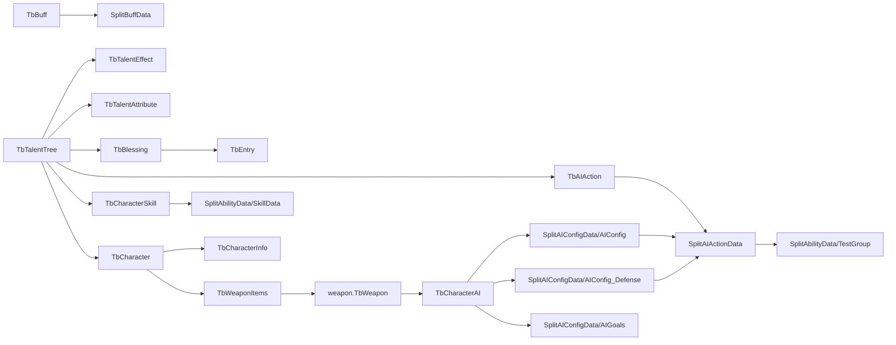

# WGame 数据关系审计

> Status: Frozen for Phase 9 closeout input
> Owner: Framework Producer / Codex Review
> Last Verified: 2026-05-09
>
> **本文涉及的 AI 概念属于 AIAction Config 域**（旧 WGame AI 行为配置数据的跨源引用审计）。不包含 Runtime AI Planner、Authoring AI Assist 或 Development Agent。详见 `Docs/INTERFACES.md` 的 AI Terminology 章节。
>
> Fact Conclusions: 本文冻结跨源引用链路和关系校验结果，尤其是 `TbAIAction -> AIActionGraph -> AbilityGraph`、`TbCharacterAI -> AIConfig`、`TbBuff -> BuffGraph` 与 `TalentTree(effectType,effectId)` 多态引用。
>
> Pending Confirmation: `FatOgre_3` 缺失、Skill/Buff Graph-only 分类、MapGraph 拆分和字符串 AI 配置名治理仍需迁移试点或 WGame 项目层确认；本文不把这些待确认项静默视为通过。

> 目标：审计 WGame 各类配置数据之间的引用关系，为后续统一配置结构、Schema 校验和迁移顺序提供依据。本文只记录关系事实和设计影响，不迁移真实数据。

## 1. 核心结论

WGame 当前数据不是单层表结构，而是“两层数据 + 多个桥接点”：

- Luban/BaseData 表负责 UI 展示、奖励池、角色/武器/成长等可见配置。
- Split JSON 负责 Ability、AIAction、AIConfig、Buff 等复杂运行时结构。
- 两层之间通过 ID 或字符串名称桥接。

最关键的桥接链路：



设计影响：

- 新配置系统必须支持显式引用规则，不能只校验单表字段。
- `AIAction`、`CharacterSkill`、`Buff` 都需要“表格索引 + Graph 详情”的双层结构。
- `TalentTree.param1/param2` 是多态引用，必须用 discriminated union 表达，不能继续保留裸 `param1/param2`。
- `CharacterAI` 和 `weapon.TbWeapon.AI` 使用字符串配置名连接 AI 图，是必须重点治理的链路。

## 2. 表格层显式引用

Luban Excel 中已经有部分 `#ref` 声明：

| 来源表 | 字段 | 目标 | 说明 |
|--------|------|------|------|
| `characters.xlsx` | `objectId` | `TbObjectData` | 角色展示/掉落对象 |
| `characters.xlsx` | `infoId` | `TbCharacterInfo` | 角色详细属性和初始配置 |
| `characters.xlsx` | `defaultWeapon` | `TbWeaponItems` | 默认武器物品 |
| `characters.xlsx` | `item` | `TbCharacterItem` | 角色物品引用 |
| `characterInfoData.xlsx` | `weapon + weaponSub` | `weapon.TbWeapon` | 初始武器组合键 |
| `characterInfoData.xlsx` | `attribute` | `TbCharacterAttribute` | 角色属性 |
| `characterInfoData.xlsx` | `entries` | `TbEntry` | 初始词条 |
| `characterInfoData.xlsx` | `audio` | `TbCharacterAudio` | 角色音频 |
| `weapons.xlsx` | `soundCfg` | `TbWeaponAudio` | 武器音频 |
| `weapons.xlsx` | `objectId` | `TbObjectData` | 武器对象 |
| `weapons.xlsx` | `AI` | `TbCharacterAI` | 武器可用 AI 配置组 |
| `weapons.xlsx` | `animBase` | `TbAnimBase` | 基础动画组 |
| `weapons.xlsx` | `animAttack` | `TbAnimAttack` | 攻击动画组 |
| `weapons.xlsx` | `animDefense` | `TbAnimDefense` | 防御动画组 |
| `#WeaponItems.xlsx` | `rightID + leftID` | `weapon.TbWeapon` | 武器物品到左右手武器组合 |

关系校验结果：

| 关系 | 引用数 | 缺失数 | 备注 |
|------|--------|--------|------|
| `TbCharacter.objectId -> TbObjectData` | 3 | 0 | 有效 |
| `TbCharacter.infoId -> TbCharacterInfo` | 13 | 0 | 有效 |
| `TbCharacter.defaultWeapon -> TbWeaponItems` | 9 | 0 | 有效 |
| `TbCharacter.baseSkill -> TbCharacterSkill` | 4 | 0 | 有效 |
| `TbCharacterInfo.attribute -> TbCharacterAttribute` | 14 | 0 | 有效 |
| `TbCharacterInfo.audio -> TbCharacterAudio` | 43 | 0 | 有效 |
| `TbCharacterInfo.entries -> TbEntry` | 9 | 0 | 有效 |
| `weapon.TbWeapon.soundCfg -> TbWeaponAudio` | 15 | 0 | 有效 |
| `weapon.TbWeapon.objectId -> TbObjectData` | 74 | 0 | 有效 |
| `weapon.TbWeapon.AI -> TbCharacterAI` | 132 | 0 | 有效 |
| `weapon.TbWeapon.animBase -> TbAnimBase` | 55 | 0 | 有效 |
| `weapon.TbWeapon.animAttack -> TbAnimAttack` | 55 | 0 | 有效 |
| `weapon.TbWeapon.animDefense -> TbAnimDefense` | 12 | 0 | 有效 |
| `TbWeaponItems.rightID/leftID -> weapon.TbWeapon` | 22 | 0 | 有效 |

注意：

- `TbCharacterInfo.weapon + weaponSub -> weapon.TbWeapon` 有一个 `(0,0)` 占位组合，不应按错误处理。
- 这些关系在新 Schema 中应直接变成 `reference` 或 `compositeReference`。

## 3. Ability / AIAction 链路

### 3.1 AIAction 表到 AIAction Graph

关系：

```text
TbAIAction.id -> SplitAIActionData.B[0]
SplitAIActionData.B[4] -> SplitAbilityData/TestGroup.B[0]
```

校验结果：

| 项 | 结果 |
|----|------|
| `TbAIAction` 行数 | 499 |
| `SplitAIActionData` 有效文件 | 500 |
| `SplitAIActionData` ID 范围 | 0-499 |
| `TbAIAction` 覆盖情况 | 1-499 全部存在对应 Graph |
| Split-only ID | `0` |
| `SplitAIActionData.B[4]` 引用 Ability 数 | 495 |
| 缺失 Ability 引用 | 0 |

判断：

- `TbAIAction` 是可见元数据和奖励/品质/消耗配置。
- `SplitAIActionData` 是运行时行为详情。
- ID `0` 是 Graph 层保留或占位行为，不在可见表中。
- 新结构应拆为 `AIAction.tsv` + `Graphs/AIAction/*.json`，并要求两者按 ID 建立可校验关系。

### 3.2 CharacterSkill 表到 SkillData Graph

关系：

```text
TbCharacterSkill.id -> SplitAbilityData/SkillData.B[0]
```

校验结果：

| 项 | 结果 |
|----|------|
| `TbCharacterSkill` ID | 0-47，共 48 个 |
| `SkillData` ID | 1-51，共 51 个 |
| 表中缺 Graph | `0` |
| Graph-only | `48, 49, 50, 51` |

判断：

- `TbCharacterSkill` 和 `SkillData` 不是完全一一对应。
- ID `0` 更像 UI/占位或特殊技能。
- `48-51` 是 Graph-only 技能，不能直接按缺表错误处理。
- 新 Schema 需要支持 `visibleInTable` 或 `graphOnly` 这类分类标记。

## 4. AIConfig 链路

### 4.1 CharacterAI 到 SplitAIConfigData

关系：

```text
weapon.TbWeapon.AI[] -> TbCharacterAI.id
TbCharacterAI.fightAI -> SplitAIConfigData/AIConfig.Name
TbCharacterAI.reactAI -> SplitAIConfigData/AIConfig_Defense.Name
TbCharacterAI.goal -> SplitAIConfigData/AIGoals.Name
SplitAIConfigData/AIConfig.Actions[] -> SplitAIActionData.B[0]
SplitAIConfigData/AIConfig_Defense.Actions[] -> SplitAIActionData.B[0]
```

校验结果：

| 关系 | 引用数 | 缺失数 | 备注 |
|------|--------|--------|------|
| `weapon.TbWeapon.AI[] -> TbCharacterAI.id` | 132 | 0 | 有效 |
| `TbCharacterAI.fightAI -> AIConfig.Name` | 133 | 1 | `FatOgre_3` 缺失 |
| `TbCharacterAI.reactAI -> AIConfig_Defense.Name` | 1 | 0 | 有效 |
| `TbCharacterAI.goal -> AIGoals.Name` | 1 | 0 | 有效 |
| `AIConfig.Actions[] -> SplitAIActionData.ID` | 332 | 0 | 有效 |
| `AIConfig_Defense.Actions[] -> SplitAIActionData.ID` | 15 | 0 | 有效 |

发现：

- `TbCharacterAI` 中存在 `id=fightAI=FatOgre_3`，但 `SplitAIConfigData/AIConfig` 只有 `FatOgre_1`、`FatOgre_2`。
- 这可能是未完成配置、废弃引用或缺失导出，需要 WGame 项目层确认。

设计影响：

- `AIConfig.Name` 当前是字符串主键，不是 ID 主键。
- 新结构建议把 AI 配置改为稳定 ID + 唯一 name，表格和 Graph 都使用 ID 引用，name 只用于显示和调试。
- 在迁移前，`FatOgre_3` 必须被标成 warning，而不是 silent pass。

## 5. Buff 链路

关系：

```text
TbBuff.id -> SplitBuffData.Buff.Data[0]
Ability/Event/Entry 运行时 -> DataMgr.TryGetBuffData(id) -> SplitBuffData
UI 文案/图标 -> GameData.Tables.TbBuff
```

校验结果：

| 项 | 结果 |
|----|------|
| `TbBuff` 行数 | 60 |
| `SplitBuffData` 有效文件 | 178 |
| `SplitBuffData` 类型数 | 9 |
| `TbBuff` 缺 Graph | 0 |
| Graph-only Buff | 118 |

`SplitBuffData.Type` 分布：

| Type | 数量 |
|------|------|
| `Numerical` | 49 |
| `CastOrbTrack` | 12 |
| `Status` | 26 |
| `ChangeAttr` | 13 |
| `CastOrbLinear` | 29 |
| `DamageByAttr` | 19 |
| `Positive` | 17 |
| `CastOrbBezier` | 7 |
| `Condition` | 6 |

判断：

- `TbBuff` 只覆盖可展示 Buff 元数据。
- `SplitBuffData` 覆盖完整运行时 Buff，包括大量内部 Buff。
- 新结构不能要求所有 Buff 都必须出现在 UI 表中；应区分 `public/display` 与 `internal/runtime`。
- `Buff.tsv` 可保存可见元数据，`Graphs/Buff/*.json` 或类型化 Buff JSON 保存运行时结构。

## 6. Talent / Blessing / Entry 链路

### 6.1 TalentTree 多态引用

`TbTalentTree.param1` 决定 `param2` 的目标表：

| `param1` | 类型 | `param2` 目标 | 数量 | 缺失数 |
|----------|------|---------------|------|--------|
| 0 | 效果 | `TbTalentEffect` | 36 | 0 |
| 1 | 基础属性 | `TbTalentAttribute` | 12 | 0 |
| 2 | Blessing | `TbBlessing` | 8 | 0 |
| 3 | AIAction | `TbAIAction` | 32 | 0 |
| 4 | CharacterSkill | `TbCharacterSkill` | 25 | 0 |
| 5 | Character | `TbCharacter` | 4 | 0 |

判断：

- `param1/param2` 是典型多态引用。
- 新结构应改为：

```json
{
  "effect": {
    "kind": "AIAction",
    "id": 123
  }
}
```

或 TSV 中拆成：

```text
effectType  effectId
AIAction    123
```

但 Schema 必须根据 `effectType` 校验 `effectId` 的目标表。

### 6.2 Blessing 到 Entry

关系：

```text
TbBlessing.listEntry[].Entries[].id -> TbEntry.id
```

校验结果：

| 项 | 结果 |
|----|------|
| `TbBlessing` 行数 | 14 |
| 引用 Entry 数 | 52 |
| 缺失 Entry | 0 |

判断：

- `TbBlessing.listEntry` 是分级结构，不适合强行压成普通列。
- 新结构可以保留 `Blessing.tsv` 的基础字段，把分级 Entry 列表放入 `Graphs/Blessing/*.json`，或使用清晰的重复行表 `BlessingEntries.tsv`。

## 7. Map 链路

Map 数据没有走 `TbMapData.id -> Graph.id` 的常规 ID 关系，而是大量使用场景名或拼接名称：

```text
Unity Scene Name -> WAbilityMgr.TryGetMapData(name)
MapTrigger eventId -> WAbilityMgr.TryGetMapTriggerData(id)
MapSettingData Ability.Properties -> roundTime/chess/speed/light 等运行时参数
MapSettingData EventList -> MapEventAddCharacter 等地图事件
```

代码证据：

- `MapManager.SetMap(sceneName)` 通过场景名查 `MapSettingData`。
- `MapManager.UpdateMapSetting()` 读取 `light`、`speed` 等 Ability property。
- `MapDataAnalizer` 读取 `roundTime`、`chess`，并从事件列表统计敌人生成。
- `MapTriggerMgr.AddMapData(eventId)` 通过 ID 查 `MapTriggerData`。

判断：

- Map 是 AbilityData 结构的复用，不是普通表。
- 新结构建议把地图配置从 Ability Graph 中拆出独立 `MapGraph` 或至少增加 `graphKind=MapSetting/MapTrigger`。
- 场景名引用必须显式化，否则无法做自动引用检查。

## 8. 多语言链路

当前 Luban 源表中 `text` / `text?` 字段保存多语言 key，BaseDataJson 导出后已经变成当前语言的文本。

例子：

- `#AIAction.xlsx` 中 `name/desc` 是 text key。
- `#Buff.xlsx` 中 `name/desc` 是 text key。
- `#Entry.xlsx` 中 `name/desc` 是 text key。
- `#lang.xlsx` 是 key 到文本的来源。
- `BaseDataJson/{locale}` 是按语言复制后的运行时产物。

判断：

- 新权威源不能以 `BaseDataJson/{locale}` 作为业务表来源。
- 新结构应保留业务表中的 `nameKey/descKey`，多语言文本进入 `Localization.tsv`。
- BaseDataJson 的多语言目录只能作为旧运行时导出产物审计，不应成为 AI 修改入口。

## 9. 迁移顺序建议

按关系复杂度和收益排序：

1. **AIAction 关系试点**：先建 `AIAction.tsv + Graphs/AIAction/*.json + Ability 引用校验`，因为它连接了表格、AI、Ability 三条主链。
2. **Buff 关系试点**：建立 `Buff.tsv + Graphs/Buff/*.json`，明确 public/internal 分类。
3. **TalentTree 多态引用治理**：把 `param1/param2` 改为可读的 discriminated union 结构。
4. **Character/Weapon/AIConfig 字符串引用治理**：把 `CharacterAI` 和 `AIConfig.Name` 的字符串引用改成稳定 ID。
5. **MapGraph 拆分**：把场景名、地图参数和地图事件从 AbilityData 复用中独立出来。

不建议下一步直接全量迁移所有表，因为当前最大风险不是格式，而是隐式引用关系。

## 10. 下一步

Split Graph 结构主干已补充到 `Docs/WGAME_SPLIT_GRAPH_AUDIT.md`。建议下一轮进入 `AIAction` 真实结构设计：

- 定义 `AIAction.tsv` 的字段。
- 定义 `AIActionGraph.schema.json`。
- 明确 `AIAction -> AbilityGraph` 引用规则。
- 明确 `AIConfig.Actions[] -> AIAction` 引用规则。
- 在文档中给出 1 个从旧数据到新结构的示例，但不提交 WGame 真实数据。
